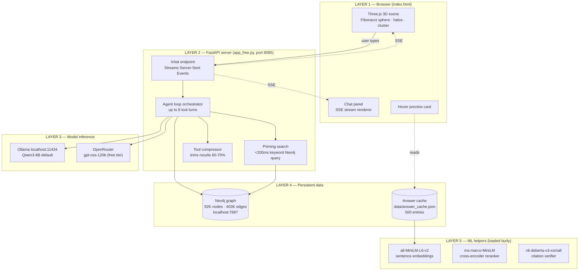
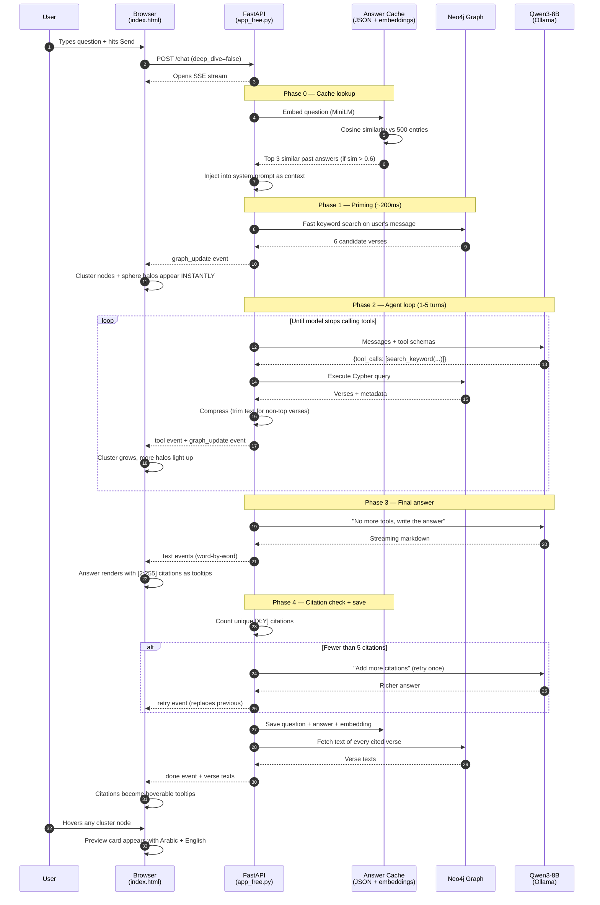
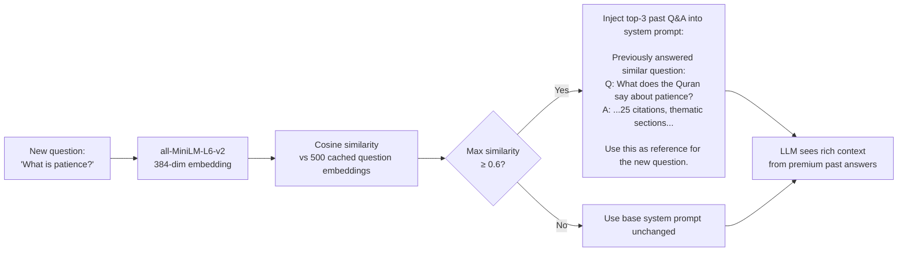
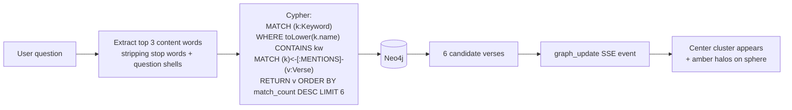
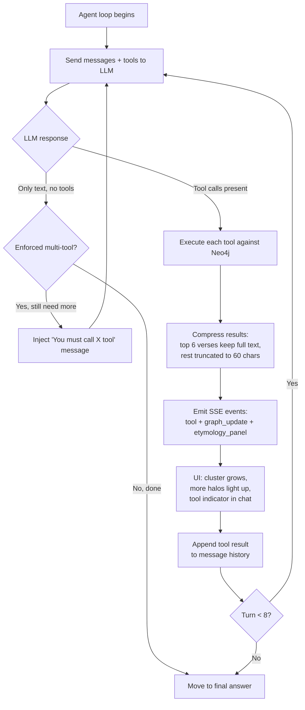
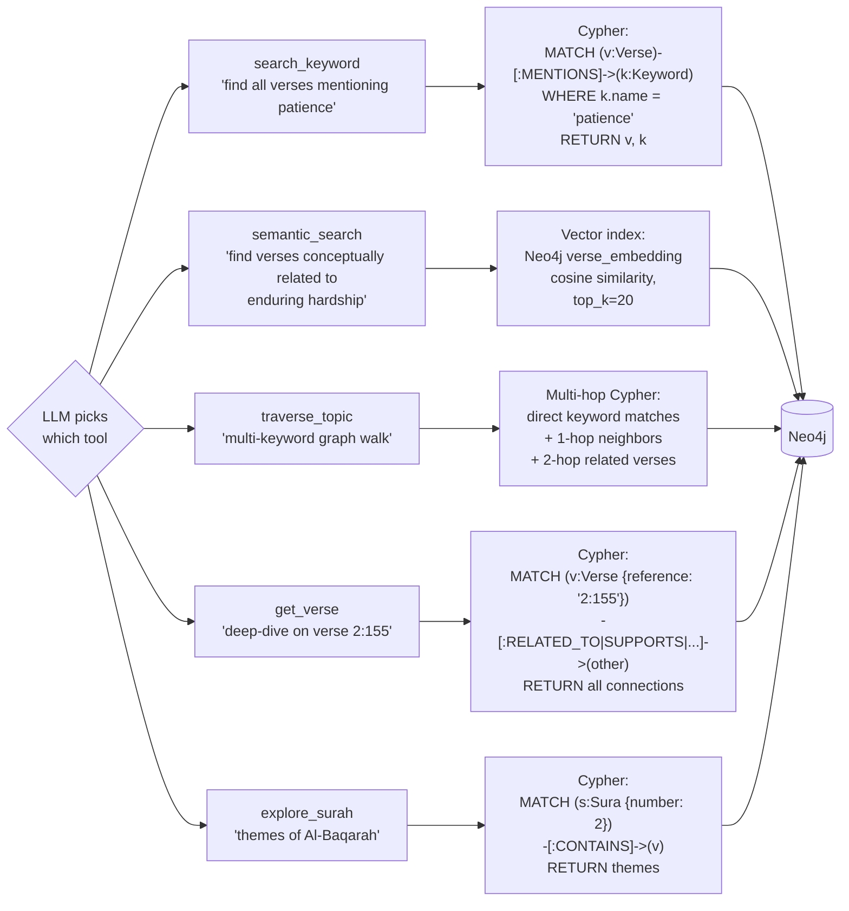
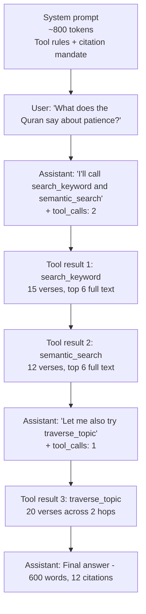
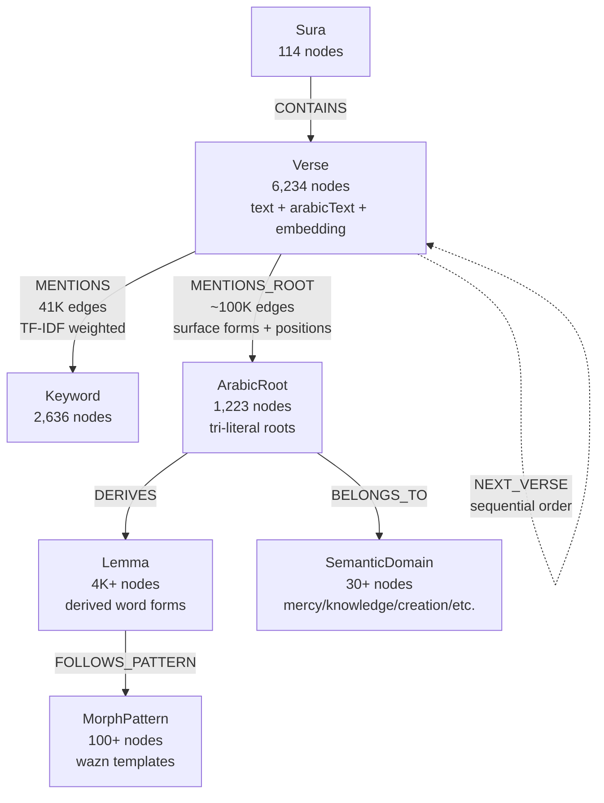

# Quran Knowledge Graph — Architecture Deep Dive

A complete walkthrough of what happens between the moment you type a question and the moment the cited answer appears on screen. All diagrams are [Mermaid](https://mermaid.js.org) — they render inline on GitHub, Obsidian, Notion, VS Code's markdown preview, and most modern viewers.

---

## The 5 architectural layers



**Layer 1** is a single-file SPA (`index.html`) — Three.js for the sphere, vanilla JS for the chat, 3d-force-graph for the dynamic cluster.

**Layer 2** is a lean FastAPI app (`app_free.py`). It doesn't generate anything itself — it orchestrates the agent loop and streams events back.

**Layer 3** is the "brain" — an LLM that decides which tools to call. Two options:
- **Ollama** runs models locally on your GPU (Qwen3-8B, 14B)
- **OpenRouter** brokers API access to bigger free-tier models (gpt-oss-120b, Qwen3-Coder-480B)

**Layer 4** is persistent storage — the Neo4j graph (the actual Quran data) and the JSON answer cache.

**Layer 5** is three small transformer models loaded on-demand for semantic search, reranking, and citation verification. They run on CPU in <500MB RAM each.

---

## End-to-end request flow

What happens when you type "What does the Quran say about patience?" and hit Send:



Let me break down each phase in detail.

---

## Phase 0 — Cache lookup (before the AI even starts)

The single most important optimization. Before running anything expensive, we check if we've already answered a similar question.



**Why this matters:** the cache was seeded with a big 120B model. When the local 8B model sees those cached answers as context, it produces answers **close to the 120B's quality** — because it's essentially paraphrasing + extending prior work, not generating from scratch.

---

## Phase 1 — Priming search (instant feedback, ~200ms)

Before the LLM runs at all, we do a quick keyword-based Neo4j query to surface 3-6 candidate verses. These appear as a cluster **within 200ms** so the user sees something happen immediately.



Completely independent of the LLM — just gives the user "something" to look at while the model thinks.

---

## Phase 2 — The agent tool loop

This is where the actual "intelligence" happens. The LLM is given a system prompt + 5 tool schemas and told to explore the knowledge graph to answer the question.



### The 5 core tools (in the free version)



The full paid versions have **15 tools** including Arabic root analysis, word-level etymology, and polysemy lookups. The free version was trimmed to 5 because 14B local models choke on 15 tool schemas in their context window.

### What the LLM actually sees per turn

A typical 3-turn conversation has a message history that looks like this:



Total context size: ~4,000 input tokens by the final turn.

---

## Phase 3 — Neo4j graph structure (what the tools actually query)

The Quran knowledge graph has 7 node types and 8+ relationship types:



**Key numbers:**
- **6,234 verses** — every ayah of the Quran (excluding 9:128-129 per Khalifa)
- **2,636 keywords** — English lemmas weighted by TF-IDF rarity
- **1,223 Arabic roots** — tri-literal (3-letter) roots with surface forms in each verse
- **51K RELATED_TO edges** — verse-to-verse thematic connections (93.7% cross-surah)
- **Vector index** — 384-dim embeddings on every verse for semantic search

### What a tool result looks like

When `search_keyword('patience')` runs, Neo4j returns something like:

```json
{
  "keyword": "patience",
  "total_verses": 27,
  "by_surah": {
    "2": [
      {"verse_id": "2:153", "text": "O you who believe, seek help through steadfastness...", "score": 0.92},
      {"verse_id": "2:155", "text": "We will surely test you with some fear and hunger...", "score": 0.88}
    ],
    "3": [...],
    "16": [...]
  },
  "retrieval_quality": "good"
}
```

The tool compressor then rewrites this — keeps full text for the top 6 verses, trims the rest to 60 chars — before feeding it back to the LLM. This cuts tokens 60-70% while preserving the signal.

---

## Phase 4 — Citation check + retry (the hallucination guard)

```mermaid
graph TB
    ANS[Model produces answer] --> SCAN[Scan for [X:Y] citations with regex]
    SCAN --> COUNT[Count unique citations]
    COUNT --> QTYPE{Question type?}
    QTYPE -->|Simple lookup<br/>'verse 2:255'| ACCEPT[Accept, even 1 citation]
    QTYPE -->|Topical question<br/>'what about patience?'| CHECK{Citations ≥ 5?}
    CHECK -->|Yes| ACCEPT
    CHECK -->|No| RETRY[Inject: 'Your answer only has N citations.<br/>Add more thematic sections with more verse refs.']
    RETRY --> REGEN[LLM regenerates with same tool context]
    REGEN --> SCAN
    ACCEPT --> FETCH[Fetch full text of every cited verse from Neo4j]
    FETCH --> SSE[Stream done event with verse texts to browser]
    SSE --> UI[Citations become hoverable tooltips]
```

**Why this works:** the model has already run tools and has verses in its context. The "retry" doesn't re-search — it just re-writes the answer with more citation density from the verses already retrieved.

The full paid version (`app_full.py`) has **three additional hallucination checks**:
1. **Cross-encoder reranking** (retrieval_gate.py) — reranks tool results by relevance before the LLM sees them
2. **NLI verification** (citation_verifier.py) — checks that each cited verse actually *entails* the claim made about it
3. **Uncertainty probes** (uncertainty.py) — generates 5 answers via a cheap model, measures semantic entropy, abstains if high

---

## Phase 5 — The 3D visualization

Two layers that update in real-time as the agent loop runs:

```mermaid
graph TB
    subgraph STATIC["Static backdrop (rendered once at page load)"]
        PTS[6,234 point cloud<br/>Fibonacci sphere<br/>positioned by<br/>GALAXY_POSITIONS[verseId]]
        LABELS[114 surah label sprites<br/>fade with camera distance]
    end

    subgraph DYNAMIC["Dynamic layer (updates per SSE event)"]
        CLUSTER[Cluster nodes<br/>d3 force-directed<br/>at origin<br/>emerald spheres + labels]
        EDGES[Cluster edges<br/>with flowing particles]
        HALOS[Amber halo sprites<br/>at verse positions<br/>on the sphere surface]
        POINTS_TINT[Point cloud colors<br/>active verses → amber<br/>neighbors → faint amber]
    end

    SSE[SSE graph_update event<br/>nodes + links + active] --> EXTRACT[Parse verse IDs<br/>strip 'v:' prefix]
    EXTRACT --> ACTIVE[Active verse IDs]
    EXTRACT --> NEIGHBOR[Neighbor verse IDs]

    ACTIVE --> HALOS
    NEIGHBOR --> POINTS_TINT
    ACTIVE --> CLUSTER
    NEIGHBOR --> CLUSTER
```

**The insight:** the sphere is a *map of the entire Quran* — fixed, never moves. The cluster is a *dynamic working-memory view* — what the AI is thinking about *right now*. The halos are the bridge: they tell you "these cluster nodes live *there* on the map."

When you hover a cluster node:
1. Raycaster hits the 3d-force-graph node (not the point cloud)
2. Browser fetches verse data from local state (already fetched via `done` event)
3. Preview card positions near cursor with Arabic + English
4. Active highlight keywords get wrapped in `<mark>` tags

---

## What makes this different from generic RAG

Most "ask the Quran an AI" tools use retrieval-augmented generation:
1. Embed the question
2. Vector search for top-10 similar verses
3. Stuff them into a prompt
4. Ask GPT to answer

This app is **agentic**, not RAG:
1. The LLM *decides* which tool to use (keyword search? semantic search? graph traversal? Arabic root lookup?)
2. It runs multiple tools sequentially, using results from one to inform the next
3. Each tool returns **structured, typed data** — not just text chunks
4. The graph has **semantic relationships** (SUPPORTS, CONTRASTS, ELABORATES) the LLM can exploit

The result is much more like "a researcher with a powerful search tool" than "autocomplete with context." It's slower (15-60s per question) but produces answers with **25-40 citations** organized thematically — the kind of output you'd expect from a scholar, not a chatbot.

---

## Deployment modes

The same core architecture runs in four configurations:

| Mode | Model | Extra features | Cost per query | File |
|---|---|---|---|---|
| **Free** | Local Qwen3-8B via Ollama | None | $0 | `app_free.py` |
| **Lite** | Claude Haiku 4.5 | None | ~$0.04 | `app_lite.py` |
| **Standard** | Claude Sonnet 4.5 | Citation retry | ~$0.14 | `app.py` |
| **Full** | Claude Sonnet 4.5 | + uncertainty probes, NLI verification, cross-encoder rerank | ~$0.18 | `app_full.py` |

All four share:
- The same Neo4j graph
- The same 500-entry cache
- The same 3D UI
- The same tool definitions

---

## Source map (key files)

| File | Purpose |
|---|---|
| `index.html` | Browser frontend — 3D sphere, chat, hover cards, SSE consumer |
| `app_free.py` | FastAPI server, agent loop, tool dispatch, caching orchestration |
| `chat.py` | The 15 tool function bodies (Cypher queries) + default system prompt |
| `answer_cache.py` | Embedding-based cache lookup and save |
| `tool_compressor.py` | Trims tool results to save tokens |
| `retrieval_gate.py` | Cross-encoder reranking (paid mode) |
| `citation_verifier.py` | NLI-based citation checking (paid mode) |
| `uncertainty.py` | Semantic entropy uncertainty probe (paid mode) |
| `prompts/system_prompt_free.txt` | Instructions for the free-tier model |
| `data/answer_cache.json` | 500-entry cache |
| `pipeline_config.yaml` | All tunable knobs (top_k, thresholds, etc.) |

That's the whole picture. Every piece is replaceable — you could swap Qwen3 for Llama, Neo4j for PostgreSQL+pgvector, Ollama for vLLM. The architecture is deliberately modular so the moving pieces can evolve independently.
